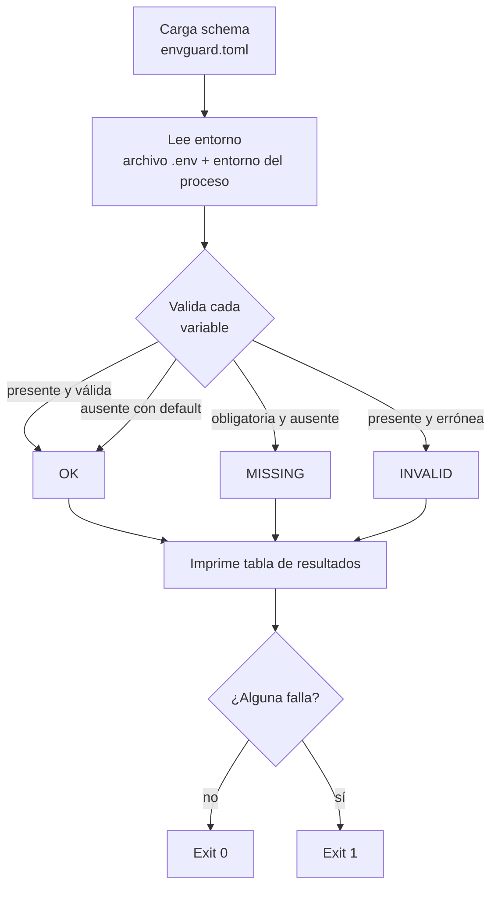

<!-- ══════════════════════════ PORTADA ══════════════════════════ -->
<div align="center">
  
</div>

<br/>

<!-- ══════════════════════ IDIOMAS / LANGUAGES ══════════════════════ -->
<div align="center">
<a href="README.md"></a>
<a href="README.en.md"></a>
<a href="README.es.md"></a>
</div>

<br/>

<div align="center">


</div>

<div align="center">
<a href="#acerca-de"></a>
<a href="#cómo-funciona"></a>
<a href="#uso"></a>
<a href="#schema"></a>
</div>

<br/>

> 🐍 **Solo standard library.** Cero dependencias de terceros que instalar, auditar o mantener actualizadas.

## Acerca de

**envguard** es una herramienta de línea de comandos que valida tus variables de entorno contra un schema declarativo. Apúntala a un `envguard.toml`, córrela en tu pipeline de CI o entrypoint del contenedor, y recibe un reporte claro de pass/fail antes de que tu aplicación siquiera inicie.

**Destacados:**
- **Schema declarativo** en TOML puro (parseado con `tomllib` de la stdlib).
- **Chequeos de tipo ricos**: `string`, `int`, `float`, `bool`, `url`, `email`, `enum`, `regex`.
- Variables **obligatorias vs. opcionales**, con **valores por defecto**.
- Soporte de archivo **`.env`** vía `--env-file`, sobrepuesto por el entorno real del proceso.
- **Tabla de resultados** alineada con filas `OK`/`MISSING`/`INVALID`.
- **Salida JSON** vía `--format json` para consumo por CI.
- **Exit codes CI-friendly**: `0` cuando todo pasa, `1` en cualquier falla.

## Cómo funciona



## Uso

```bash
git clone https://github.com/geoggrigori/envguard.git
cd envguard
pip install .
```

Escribe un schema describiendo las variables que tu app espera:

```toml
# envguard.toml
[DATABASE_URL]
required = true
type = "url"

[PORT]
required = true
type = "int"

[LOG_LEVEL]
type = "enum"
values = ["debug", "info", "warning", "error"]
default = "info"
```

```bash
envguard --schema envguard.toml
envguard --schema envguard.toml --env-file .env
envguard --schema envguard.toml --format json
```

**Salida de ejemplo:**
```text
VARIABLE         STATUS   DETAIL
---------------  -------  ----------------------------
DATABASE_URL     OK       url
PORT             OK       int
ADMIN_EMAIL      MISSING  required but not set
RELEASE_TAG      INVALID  value '1.4.2' does not match /v\d+\.\d+\.\d+/

6 ok, 2 failed, 8 total
```

## Schema

| Campo | Significado |
|---|---|
| `required` | `true` si la variable debe estar presente (por defecto `false`) |
| `type` | `string`, `int`, `float`, `bool`, `url`, `email`, `enum`, `regex` (por defecto `string`) |
| `values` | Lista de valores permitidos; obligatorio cuando `type = "enum"` |
| `pattern` | Regex que el valor debe coincidir; obligatorio cuando `type = "regex"` |
| `default` | Valor usado cuando la variable está ausente; reportado como `OK` |

**Pruebas:**
```bash
pip install -e ".[dev]"
python -m pytest
```

## Licencia

[MIT](LICENSE).

<div align="center">
  
</div>

<p align="center"><sub>Desarrollado por <strong><a href="https://github.com/geoggrigori">Grigori</a></strong> · 2026</sub></p>
