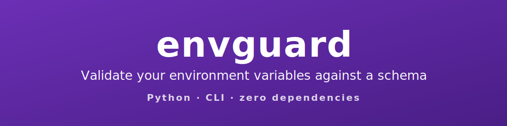
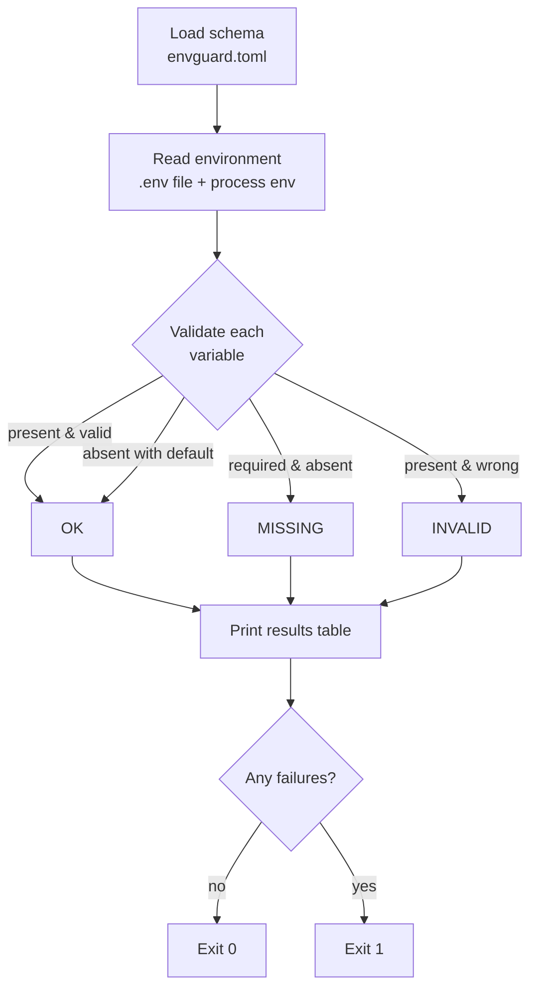

[](https://www.python.org/downloads/)
[](LICENSE)
[](tests/)
[](pyproject.toml)

**envguard** is a tiny command-line tool that validates your environment
variables against a declarative schema. Point it at an `envguard.toml`, run it
in your CI pipeline or container entrypoint, and get a clear pass/fail report
before your application ever starts.

It is written with the Python standard library only — no third-party packages
to install, audit, or keep up to date.

## Features

- **Declarative schema** in plain TOML (parsed with stdlib `tomllib`).
- **Rich type checks**: `string`, `int`, `float`, `bool`, `url`, `email`,
  `enum`, and `regex`.
- **Required vs. optional** variables, with **defaults**.
- **`.env` file support** via `--env-file`, overlaid by the real process
  environment.
- **Aligned results table** with `OK` / `MISSING` / `INVALID` rows.
- **CI-friendly exit codes**: `0` when everything passes, `1` on any failure.
- **Zero dependencies**, single small package.

## How it works



## Installation

From source (recommended while it is unpublished):

```bash
git clone https://github.com/geoggrigori/envguard.git
cd envguard
pip install .
```

Or for local development, editable with test extras:

```bash
pip install -e ".[dev]"
```

## Usage

Write a schema describing the variables your app expects:

```toml
# envguard.toml
[DATABASE_URL]
required = true
type = "url"

[PORT]
required = true
type = "int"

[LOG_LEVEL]
type = "enum"
values = ["debug", "info", "warning", "error"]
default = "info"

[ADMIN_EMAIL]
required = true
type = "email"
```

Run the validator against the current environment:

```bash
envguard --schema envguard.toml
```

Or validate a `.env` file (process environment still takes precedence):

```bash
envguard --schema envguard.toml --env-file .env
```

A complete example schema and `.env` live in [`examples/`](examples/):

```bash
envguard --schema examples/envguard.toml --env-file examples/.env
```

### Sample output

```text
VARIABLE         STATUS   DETAIL
---------------  -------  ----------------------------
DATABASE_URL     OK       url
PORT             OK       int
DEBUG            OK       default applied ('false')
LOG_LEVEL        OK       one of ['debug', 'info', 'warning', 'error']
ADMIN_EMAIL      MISSING  required but not set
RELEASE_TAG      INVALID  value '1.4.2' does not match /v\d+\.\d+\.\d+/
TIMEOUT_SECONDS  OK       default applied ('30.0')
APP_NAME         OK       string

6 ok, 2 failed, 8 total
```

The process exits with status `1` because at least one variable failed,
making it easy to gate a CI job or a container start-up.

## Schema reference

Each top-level table names an environment variable. The following fields are
supported:

| Field      | Meaning                                                                 |
|------------|-------------------------------------------------------------------------|
| `required` | `true` if the variable must be present (default `false`).               |
| `type`     | One of `string`, `int`, `float`, `bool`, `url`, `email`, `enum`, `regex` (default `string`). |
| `values`   | List of allowed values; required when `type = "enum"`.                  |
| `pattern`  | Regular expression the value must fully match; required when `type = "regex"`. |
| `default`  | Value used when the variable is absent; the result is reported as `OK`. |

Type details:

| Type     | Accepts                                                              |
|----------|---------------------------------------------------------------------|
| `string` | Any value (presence only).                                          |
| `int`    | A whole number, e.g. `8080`, `-3`.                                  |
| `float`  | A decimal number, e.g. `30.0`, `1e3`.                               |
| `bool`   | `1`/`0`, `true`/`false`, `yes`/`no`, `on`/`off` (case-insensitive). |
| `url`    | `http`, `https`, or `ftp` URL with a host.                          |
| `email`  | `local@domain.tld`.                                                 |
| `enum`   | A member of `values`.                                               |
| `regex`  | A full match of `pattern`.                                          |

## Running tests

```bash
pip install -e ".[dev]"
python -m pytest
```

## License

Released under the [MIT License](LICENSE). Copyright (c) 2026 Geovana Grigorio.
