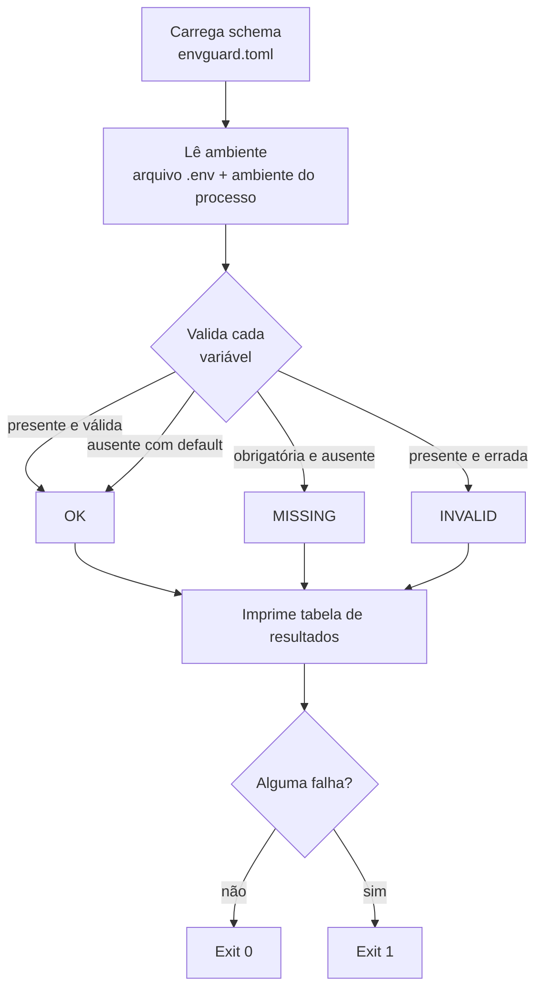

<!-- ══════════════════════════ TÍTULO ══════════════════════════ -->
<div align="center">
  
</div>

<br/>

<!-- ══════════════════════ IDIOMAS / LANGUAGES ══════════════════════ -->
<div align="center">
<a href="README.md"></a>
<a href="README.en.md"></a>
<a href="README.es.md"></a>
</div>

<br/>

<h1 align="center">envguard</h1>
<p align="center"><em>Ferramenta CLI que valida variáveis de ambiente contra um schema declarativo</em></p>
<p align="center"><strong>envguard.toml → valida .env/ambiente → tabela de resultados → exit code pra CI</strong></p>

<div align="center">


</div>

<div align="center">
<a href="#sobre"></a>
<a href="#como-funciona"></a>
<a href="#uso"></a>
<a href="#schema"></a>
</div>

<br/>

> 🐍 **Só standard library.** Zero dependências de terceiros pra instalar, auditar ou manter atualizadas.

## Sobre

**envguard** é uma ferramenta de linha de comando que valida suas variáveis de ambiente contra um schema declarativo. Aponte pra um `envguard.toml`, rode no seu pipeline de CI ou entrypoint do container, e receba um relatório claro de pass/fail antes da sua aplicação sequer iniciar.

**Destaques:**
- **Schema declarativo** em TOML puro (parseado com `tomllib` da stdlib).
- **Checagens de tipo ricas**: `string`, `int`, `float`, `bool`, `url`, `email`, `enum`, `regex`.
- Variáveis **obrigatórias vs. opcionais**, com **defaults**.
- Suporte a arquivo **`.env`** via `--env-file`, sobreposto pelo ambiente real do processo.
- **Tabela de resultados** alinhada com linhas `OK`/`MISSING`/`INVALID`.
- **Saída JSON** via `--format json` pra consumo por CI.
- **Exit codes CI-friendly**: `0` quando tudo passa, `1` em qualquer falha.

## Como Funciona


```mermaid
flowchart TD
    A[Carrega schema<br/>envguard.toml] --> B[Lê ambiente<br/>arquivo .env + ambiente do processo]
    B --> C{Valida cada<br/>variável}
    C -->|presente e válida| D[OK]
    C -->|obrigatória e ausente| E[MISSING]
    C -->|presente e errada| F[INVALID]
    C -->|ausente com default| D
    D --> G[Imprime tabela de resultados]
    E --> G
    F --> G
    G --> H{Alguma falha?}
    H -->|não| I[Exit 0]
    H -->|sim| J[Exit 1]
```

## Uso

```bash
git clone https://github.com/geoggrigori/envguard.git
cd envguard
pip install .
```

Escreva um schema descrevendo as variáveis que sua app espera:

```toml
# envguard.toml
[DATABASE_URL]
required = true
type = "url"

[PORT]
required = true
type = "int"

[LOG_LEVEL]
type = "enum"
values = ["debug", "info", "warning", "error"]
default = "info"
```

```bash
envguard --schema envguard.toml
envguard --schema envguard.toml --env-file .env
envguard --schema envguard.toml --format json
```

**Saída de exemplo:**
```text
VARIABLE         STATUS   DETAIL
---------------  -------  ----------------------------
DATABASE_URL     OK       url
PORT             OK       int
ADMIN_EMAIL      MISSING  required but not set
RELEASE_TAG      INVALID  value '1.4.2' does not match /v\d+\.\d+\.\d+/

6 ok, 2 failed, 8 total
```

## Schema

| Campo | Significado |
|---|---|
| `required` | `true` se a variável deve estar presente (padrão `false`) |
| `type` | `string`, `int`, `float`, `bool`, `url`, `email`, `enum`, `regex` (padrão `string`) |
| `values` | Lista de valores permitidos; obrigatório quando `type = "enum"` |
| `pattern` | Regex que o valor deve casar; obrigatório quando `type = "regex"` |
| `default` | Valor usado quando a variável está ausente; reportado como `OK` |

**Testes:**
```bash
pip install -e ".[dev]"
python -m pytest
```

## Licença

[MIT](LICENSE).

<div align="center">
  
</div>

<p align="center"><sub>Desenvolvido por <strong><a href="https://github.com/geoggrigori">Grigori</a></strong> · 2026</sub></p>
